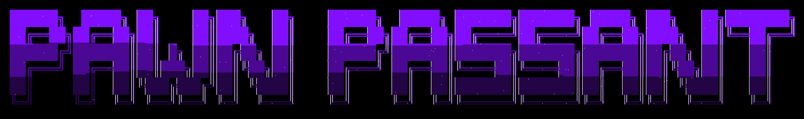

  

# Pawn Passant
This is a cross platform chess game built with Flet, a Python framework for building interactive user interfaces. The game allows players to play chess against each other or against an AI opponent. It features a clean and intuitive interface, making it easy for players of all skill levels to enjoy the game.

## Release binaries
Publishing is handled by `.github/workflows/release-build.yml`.

- Trigger a GitHub release with a tag matching `project.version` in `pyproject.toml` (for example `v0.1.0-alpha.1`).
- The workflow builds and publishes these files to that release:
  - `*.apk` for Android
  - `*-portable.zip` containing the full portable app bundle
  - `*-setup.exe` installer

